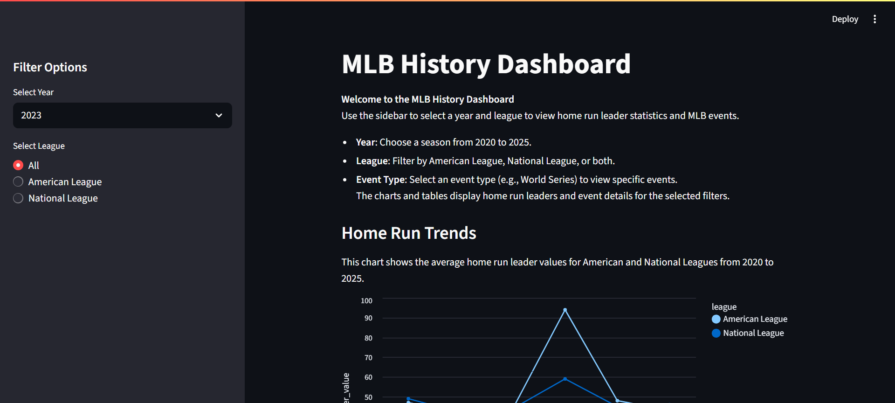
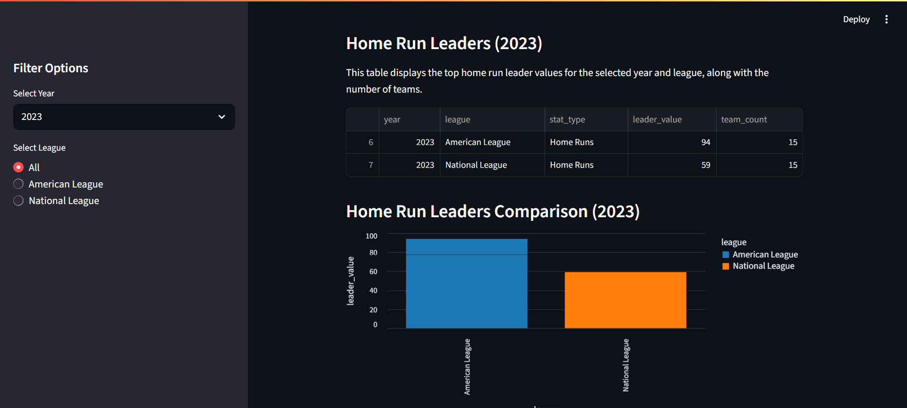
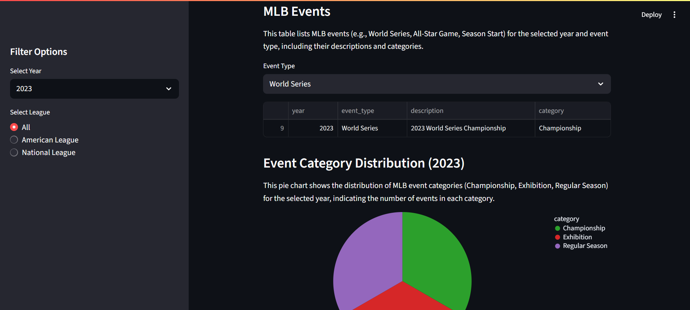

# MLB History

## Summary
This is a web scraper project with dashboard presentation that scrapes dash from MLB History site `https://www.baseball-almanac.com/yearmenu.shtml`. 

## Project Details
1. Web Scraping Program: `scraper.py`: 
    - Scrape data from Major League Baseball History.
2. Database Import Program: `import_to_db.py`: 
    - Import the CSV files into a SQLite database.
3. Database Query Program: `query_db.py`
    - Query the database via the command line.
4. Dashboard Program: `dashboard.py`
    - Build an interactive dashboard using Streamlit.

## Setup Steps
clone the project
- `git clone https://github.com/ht-l1/mlb-history.git`

set up, run, and end virtual environemnt 
- `python -m venv venv`
- `venv\Scripts\activate`
- `deactivate`

install dependencies
- `pip install -r requirements.txt`

run files 
- `python scraper.py`
- `python import_to_db.py`
- `python query_db.py`
- `streamlit run dashboard.py`

## Screenshot

